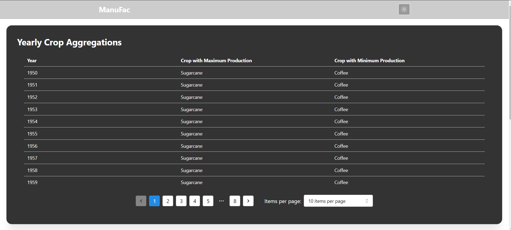
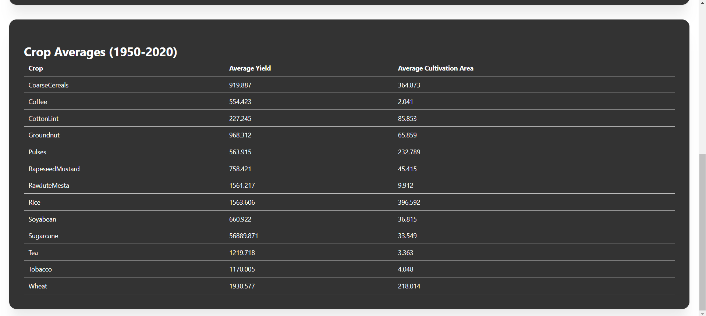

# Agro Data Analysis

This project is a data analysis application using React, TypeScript, and Vite. It provides visualizations for agricultural data.

## Components
- `AvgYieldAreaTable.tsx`: Displays average yield area data.
- `MaxMinProductionTable.tsx`: Shows the maximum and minimum production values.
- `Navbar.tsx`: The navigation bar of the application.

## Data
The data is stored in a JSON file located in `src/data/india-agro-dataset.json`.

## Utilities
- `dataProcessing.ts`: Contains functions for processing the dataset.

## Getting Started

### Prerequisites
- Node.js (version 16+ recommended)
- npm or yarn

## Screenshots 
## 1 MaxMinProductionTable

## 2 AvgYieldAreaTable


### Installation
1. Clone the repository:
   ```sh
   git clone https://github.com/shivamyadav2469/manfuc.git

## project live Link 
Link:   https://manufac001.netlify.app/
